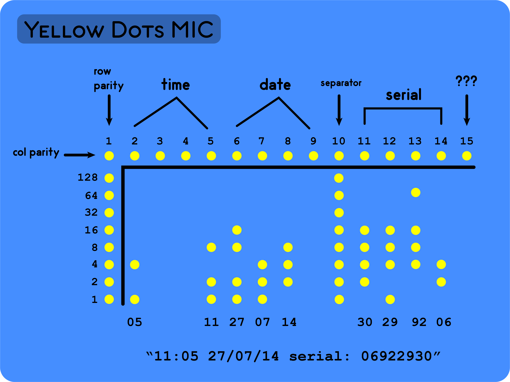

# CTF Weapon

This repository contains tools and commands that may help to solve a CTF challenges. Any contributions welcome. </br>

Table of Contents:
- #### [Steganography](#Steganography)
- #### [OSINT](#OSINT)
- #### [Decoder](#Decoder)
- #### [Cryptography](#Cryptography)

---

## Steganography

### Steganography-Tools

1. [stegsolve.jar](http://www.caesum.com/handbook/stego.htm) </br>
A Java .jar tool, that'll open an image and let you as the user arrow through different renditions of the image (viewing color channels, inverted colors, and more). </br> </br>

2. Yellow dots Machine Identification Code </br>
Is your printer spying on you? Well, the printer have its own MIC. You can checkout this [Link](https://www.instructables.com/Yellow-Dots-of-Mystery-Is-Your-Printer-Spying-on-/) </br>

 </br>


### Steganography-Commands

1. stegsolve.jar

`java -jar stegsolve.jar`

### Steganography-Install

1. stegsolve
```
wget http://www.caesum.com/handbook/Stegsolve.jar -O stegsolve.jar
chmod +x stegsolve.jar
mkdir bin
mv stegsolve.jar bin/
```

---

## OSINT

### OSINT-Tools

1. [Wayback Machine](https://archive.org/web/) </br>
A machine that'll help you to see on the Internet archive like deleted twitter messages, archived post, etc. </br> </br>

2. [Osintgram](https://github.com/Datalux/Osintgram) </br>
Osintgram is an OSINT tool on Instagram. It offers an interactive shell to perform analysis on Instagram account of any users by its nickname </br> </br>

### OSINT-Commands

1. Osintgram
`python3 main.py <username>`

### OSINT-Install

1. Osintgram

*Prerequisites:* </br>
- Python 3.6 ++
- pip3
```
git clone https://github.com/Datalux/Osintgram
cd Osintgram
python3 -m venv venv
source venv/bin/activate
pip3 install -r requirements.txt
echo "your_IG_uname" > username.conf
echo "your_IG_pass" > pw.conf
echo "{}" > settings.json
```
---

## Decoder

### Decoder-Tools

1. [Twitter Secret Messages](https://holloway.nz/steg/) </br>
An internet tool help you to decode or encode a messages. </br> </br>

---

## Cryptography

### Cryptography-Tools
1. [Dcoder](https://www.dcode.fr/en) </br>
A tool used to decrypt or encrypt Ciphertext. </br> </br>